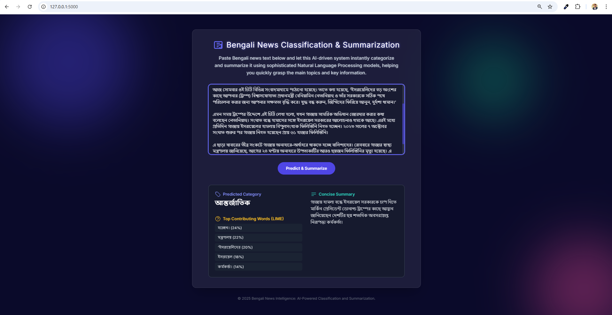

# BanglaNews: Multi-label Bengali News Classification with Explainable AI and Abstractive Summarization

## 🔍 Project Overview  
**BanglaNews** is an end-to-end **Bengali Natural Language Processing (NLP) pipeline** that integrates:  
1. **News Classification** – Automatically classifies Bengali news articles into 9 categories.  
2. **Explainable AI (XAI)** – Provides interpretable explanations using **LIME** (top 5 contributing words).  
3. **Abstractive Summarization** – Generates concise Bengali summaries of news content.  
4. **Web Deployment** – Deployed using **Django (backend)** and **React (frontend)** for real-time inference.  

🚀 **Live Demo**: [BanglaNews Web App](https://banglanews.luminatechbd.site/)  

---

## 📊 Dataset Description  
- **Source**: [`zabir-nabil/bangla_newspaper_dataset`](https://huggingface.co/datasets/zabir-nabil/bangla_newspaper_dataset)  
- **Initial Size**: 265,506 articles, 11 columns.  
- **Selected Columns**: `content` (text), `category_bn` (label).  
- **Filtering**: Removed articles < 1000 characters.  
- **Final Sampled Dataset**: 40,000 articles, top 9 categories.  

| Category (Bengali)      | Count  |  
|--------------------------|--------|  
| বাংলাদেশ                 | 21,699 |  
| খেলা                    | 4,884  |  
| আন্তর্জাতিক              | 3,031  |  
| বিনোদন                  | 2,929  |  
| মতামত                   | 2,108  |  
| অর্থনীতি                 | 1,641  |  
| জীবনযাপন                | 1,332  |  
| শিক্ষা                   | 1,230  |  
| বিজ্ঞান ও প্রযুক্তি       | 1,146  |  

---

## 🔬 Exploratory Data Analysis (EDA)  

### Distribution of Article Lengths  


### Category Distribution of Bengali News Articles  


### WordCloud of Categories  

---

## ⚙️ Methodology  

### 📰 News Classification  
- **Model**: `sagorsarker/bangla-bert-base`  
- **Training**: Fine-tuned for 3 epochs, 80%-20% train-test split.  
- **Performance**:  
  - Accuracy: **92.05%**  
  - F1-score: **92.04%**  
  - Precision: **92.06%**  
  - Recall: **92.05%**  

**Confusion Matrix**:  
  

---

### 🧾 Explainable AI (LIME)  
- Integrated **LIME** to explain predictions.  
- Displays **top 5 contributing words** per article.  
- Improves interpretability & trust in predictions.  

---

### ✂️ News Summarization  
- **Model**: `csebuetnlp/mT5_multilingual_XLSum`  
- **Approach**: Zero-shot abstractive summarization.  
- **Output**: Fluent, concise summaries.  


---

### 🌐 Web Deployment  
- **Frontend**: ReactJS  
- **Backend**: Django REST Framework + Transformers  
- **Features**:  
  - Paste Bengali news → Get prediction, top contributing words, and summary.  
  - Models and encoders loaded locally for faster inference.  

**Deployed Link**: [https://banglanews.luminatechbd.site/](https://banglanews.luminatechbd.site/)  

---

## 📈 Results  

| Metric        | Score   |  
|---------------|---------|  
| Accuracy      | 92.05%  |  
| F1-score      | 92.04%  |  
| Precision     | 92.06%  |  
| Recall        | 92.05%  |  

- **Classification**: High performance across 9 categories.  
- **Explainability**: LIME highlighted interpretable keywords.  
- **Summarization**: Concise Bengali news summaries produced.  
- **Web UI**: Seamless integration for end-users.  

**WebApp Screenshot**:  
  

---

## 🛠️ Installation & Usage  

### 1. Clone Repository  
```bash
git clone https://github.com/yourusername/banglanews.git
cd banglanews
```

### 2. Backend Setup (Django)  
```bash
cd backend
pip install -r requirements.txt
python manage.py runserver
```

### 3. Frontend Setup (React)  
```bash
cd frontend
npm install
npm start
```

### 4. Access  
Go to `http://localhost:3000` to use the app locally.  

---

## 📚 References  
- Dataset: [Bangla Newspaper Dataset](https://huggingface.co/datasets/zabir-nabil/bangla_newspaper_dataset)  
- BERT Model: [sagorsarker/bangla-bert-base](https://huggingface.co/sagorsarker/bangla-bert-base)  
- Summarizer: [csebuetnlp/mT5_multilingual_XLSum](https://huggingface.co/csebuetnlp/mT5_multilingual_XLSum)  
- LIME: Ribeiro et al., *“Why Should I Trust You?” Explaining the Predictions of Any Classifier*, KDD 2016.  

---

## 👨‍💻 Authors

**Isha Das**  
📧 [isha@idtechsolutionsbd.com]  

**Md Jisan Ahmed**  
📧 [jisan3325@gmail.com]  
